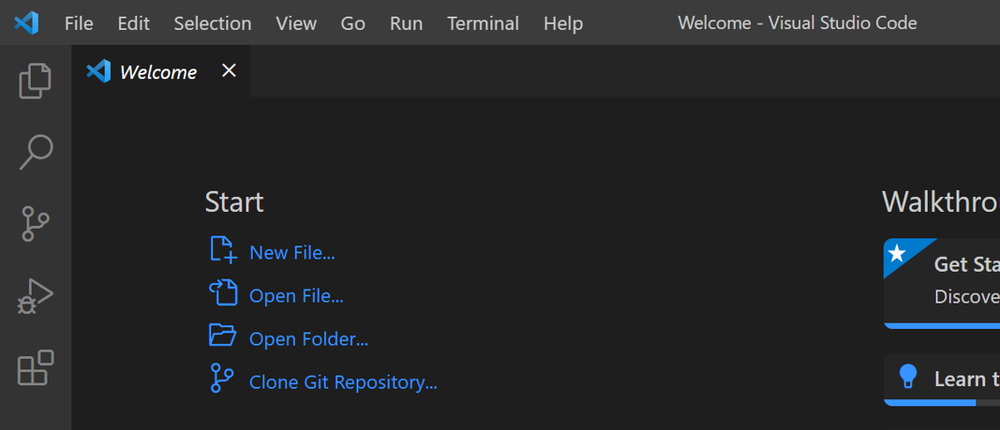

# Editor Seçimi

JavaScript kodunu yazmaq üçün sizə kod redaktoru yəni Code Editor lazımdır. Müxtəlif növ Code Editor-lar var

- Visual Studio Code və ya VSCode 
- Sublime text 
- Atom

Bunlardan ən çox bəyəndiyim `Visual Studio Code` -dur. Bu, çox sadə,  çarpaz platformaya sahib və güclü redaktordur. Gəlin birlikdə  yükləmə və quraşdırma əməliyyatını edək. Beləliklə `codevisualstudio.com` saytına daxil olursunuz. Burada `windows`  əməliyyat sistemli komputer üçun `download` düyməsi var. Əgər sizin komputeriniz başqa əməliyyat sisteminə sahibdirsə buradan sizə uyğun olanını seçə bilərsiniz. Mən `windows` əməliyyat sismetini seçirəm. Daha sonra install əməliyyatını həyata keçirirəm. Burada exe file-ı yaranır. Bu file-a daxil olursunuz və install əməliyyatını həyata keçirirsiniz. `Finish` düyməsinə kilik ediirk və VSCode açılır. Burada gördüyünüz kimi bir neçə background modu var Mən dark modu xoşlayıram və belə davam edəcəyəm. Quraşdırmağınızı istədiyim digər şey Nodedur. Əslində indi  texniki olaraq JavaScript-i yerinə yetirmək üçün Node-a ehtiyacınız yoxdur. Çünki daha əvvəl izah etdiyim kimi javascipt kodunu brauzer daxilində və ya Node-da icra edə bilərsiniz. Ancaq komputerinizdə Node-un olması yaxşıdır, həmçinin növbəti videolarda Node-un önizləməsini göstərəcəyəm. Gəlin Node-u komputerimizə yükləyək. Beləliklə, indi videonu dayandırın və Visual Studio Kodunu, həmçinin Node-u komputerinizə yükləyin bitirdikdən sonra geri qayıdın və izləməyə davam edin. 
Belə, indi yeni qovluq yaradaq, ona javascript adını vermişəm, adın heç bir əhəmiyyəti yoxdur, sadəcə olaraq bu kursda bütün kodları yazmaq üçün bir qovluğa ehtiyacımız var. İndi bu qovluğu VSCode-da açaq. Bunu etməyin iki yolur var. 

Birinci yol qovluğu Visual Studio Kodun üzərinə  sürükləyin və buraxın. Digər yol isə VSCode üzərində açılmış ilk fayl `Welcome `üzərində `Open Folder` düyməsinə kilik edirsiniz. 
## 

Və qovluğu yaratdığınız yeri seçirsiniz. Mən qovluğu Desktop-da yaratmışam ona görədə oraya daxil olub qovluğumu seçirəm. Burada yeni bir file yaradaq və onu  index.html adlandıraq.  Bu faylda nida işarəsini yazırıq və sonra tab düyməsini basırıq. Bizə lazım olan əsas html elementlərini yaratmış oluruq. Burada bu kodların heç birinə əhəmiyyət vermirik biz bunu JavaScript kodumuz üçün host kimi istifadə edəcəyik. Növbəti videoda bunu görəcəksiniz. Ona görədə gəlin dəyişiklikləri yadda saxlayaq. İndi isə extension bölməsinə keçək. buradan `live server` axtaraq və install düyməsinə kilik edərək VSCode-a yükəyirik. İndi isə keçirik exporer bölməsinə. `Live server` bizim veb tətbiqimizi browserdə görmək  üçün istifadə edəcəyimiz çox yüngül veb serverdir. Buna görə də bunu quraşdırdıq. `index.html`- in üzərinə gələrək mousun sağ düyməsini  klikləyirik və open with `live server` seçirik. Budur file-mızı brauzerdə görürük. Hər şeyin düzgün işlədiyinə əmin olmaq üçün body bölməsində h1 tag-i əlavə edək, və onun daxilinə bir cümlə yazaq  Nümunə üçün “Hello World”. İndi dəyişiklikləri yadda saxlayırıq və , brauzerə qayıdırıq, bu səhifənin avtomatik yeniləndiyini görə bilərsiniz və burada "Hello World" başlığı aydın şəkildə seçilir. Növbəti dərsdə ilk JavaScript kodumuzu yazacayıq.
